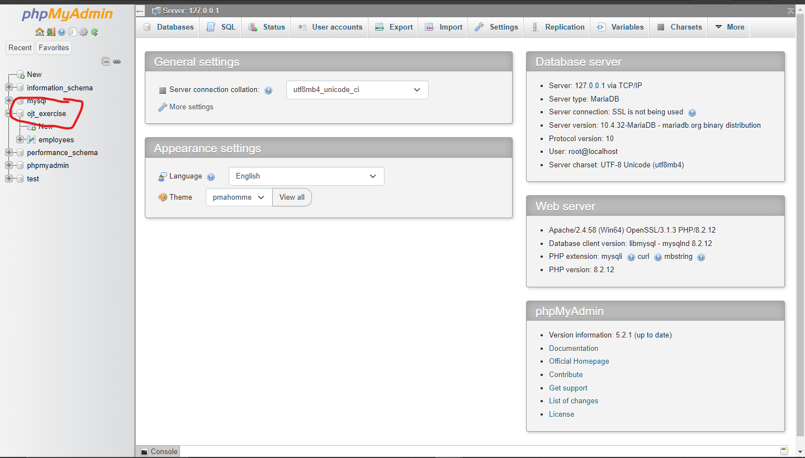
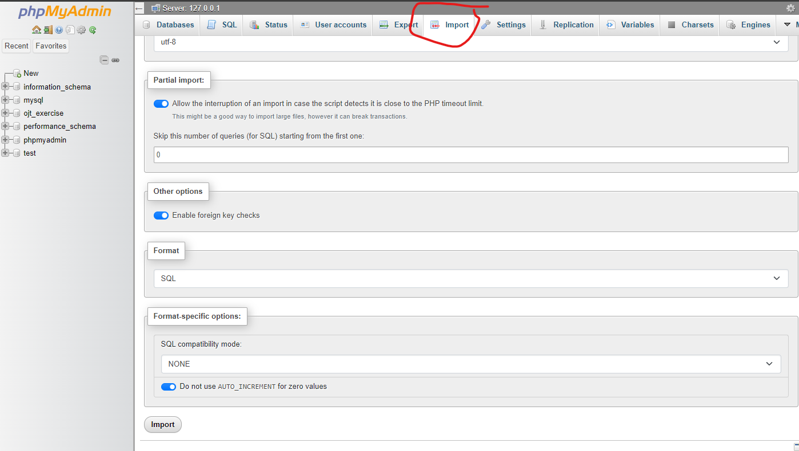
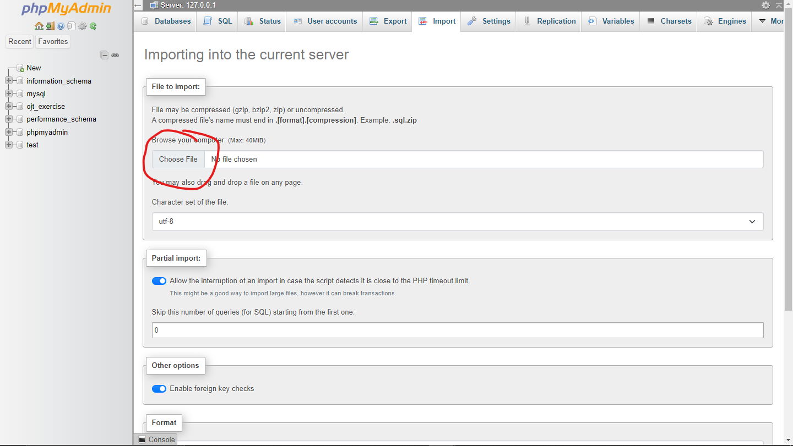
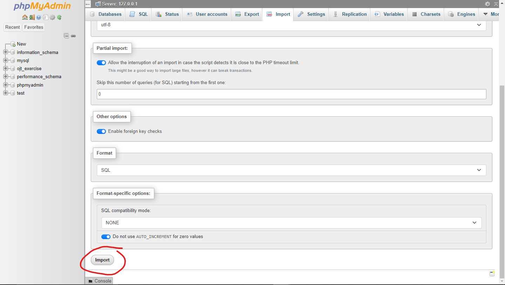
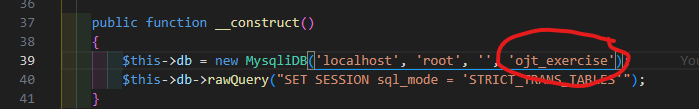

# Employee-Management

## Setup project

# Step 1

Copy and paste "employees" folder into your htdocs folder inside xampp

# Step 2

Open Xampp and start apache and mysql

# Step 3

Go to [localhost/phpmyadmin](http://localhost/phpmyadmin/) and create a new database named "ojt_exercise". Another option you can do if you don't want to create a new database is click on a database you already have and click on that.

Then click import at the top bar.

Then choose the file located in /employees/database/db.sql,

Then scroll down and click import.

# Step 4 (Skip if you created a new database from step 3 with the name "ojt_exercise")

Go to the file index.php in the employees folder you pasted in the htdocs folder of the xampp and edit line 39 and change the database name to whatever you selected in step 3.

# Step 5

Go to the root directory of the project and run command "quasar dev".
